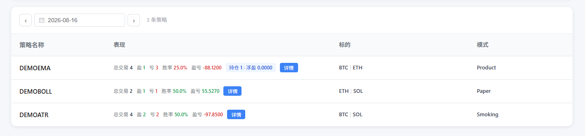
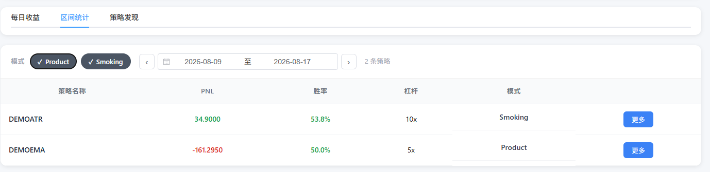
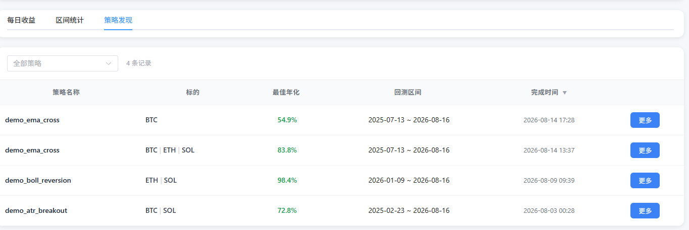
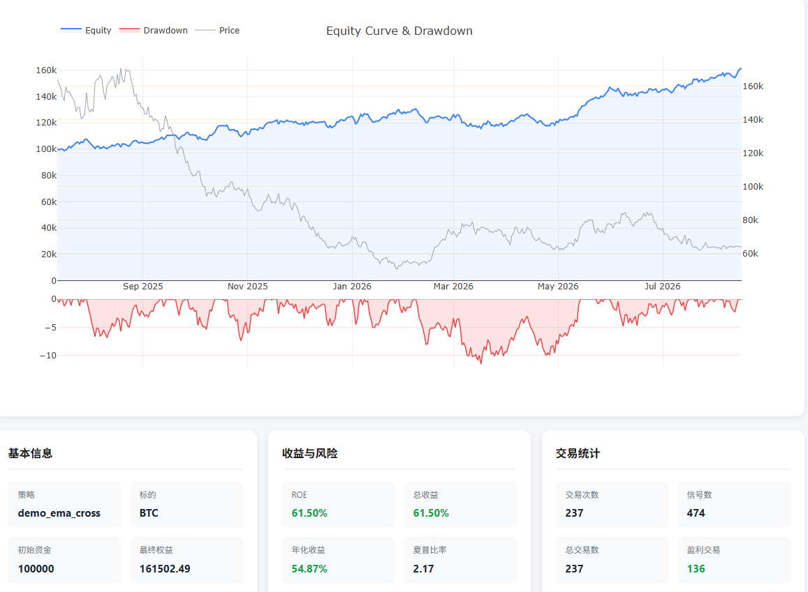

# Trading Review Frontend

交易策略复盘前端。读取静态数据文件（K线、持仓、回测、信号对比），提供策略概览与标的详情可视化。

无后端、无数据库：只要数据文件符合 [docs/DATA-SPEC.md](docs/DATA-SPEC.md) 的规范，放进 `public/` 对应目录即可运行。数据如何产出由使用方自行决定，本项目不做限制。

## 技术栈

- **Vue 3** `<script setup>` + **TypeScript**
- **Vite** 构建
- **Pinia** 状态管理
- **Element Plus** UI 组件
- **Plotly.js** 蜡烛图（`TechnicalChart.vue`）/ **ECharts** + **vue-echarts** ROI/价格趋势图
- **Vitest** 单元测试

## 架构概览

```
public/                              # 数据目录（真实目录或指向外部数据的符号链接）
├── frontend-data/                   # 策略、持仓、对比、策略表现（必需）
│   ├── strategies.json              # 策略元数据（可选，中文名/逻辑/默认指标）
│   ├── {YYYYMMDD}/
│   │   ├── manifest.json            # 当日策略清单
│   │   └── {strategy}/{SYMBOL}/
│   │       ├── positions.json       # 持仓开平仓点
│   │       ├── backtest.json        # 回放交易
│   │       └── comparison.json      # 实盘与回放信号对比
│   └── trading_data/
│       └── trading_positions_{YYYYMMDD}.csv
├── kline-data/                      # K线行情（必需）
│   └── {period}/{SYMBOL}_{period}.csv
├── backtest-output/                 # 历史回测（可选，策略发现页需要）
│   └── {strategy}/{YYYYMMDD}/{HHMMSS}/{SYMBOL}/
└── data/                            # 每日回测（可选，每日回放页需要）
    └── {YYYYMMDD}/backtest_results/{strategy}/{YYYYMMDD}/{HHMMSS}/{SYMBOL}/
```

```
public/ 静态文件  ——fetch（无后端）——>  Vue 应用（Vite dev server / 任意静态服务器）
```

本项目无后端，所有数据通过 `fetch` 读取 `public/` 下的静态文件。数据源更新后无需重新构建，刷新即生效。

完整字段规范见 [docs/DATA-SPEC.md](docs/DATA-SPEC.md)。

## 路由

| 路径 | 页面 | 说明 |
|------|------|------|
| `/` | `StrategyOverview` | 策略概览（页面1）：「策略表格 / 回测详情」tab，展示所有策略、标的、仓位统计 |
| `/detail/:strategy/:symbol` | `TokenDetail` | 标的详情（V1）：蜡烛图、ROI/价格趋势、技术指标、回放对比 |
| `/detail-v2/:strategy/:symbol` | `TokenDetailV2` | 标的详情（V2 数据分离版）：K线与仓位解耦，纯K线模式可选叠加仓位/回测 |

## 界面预览

以下截图均基于 `npm run sample-data` 生成的示例数据，展示的策略与持仓为程序合成，非真实交易数据。

### 每日收益

按日查看各策略的标的、运行模式与仓位统计。



### 每日回放

按日查看当天各策略的回测结果，可用日期选择器前后翻页。当天跑完但未触发信号的策略默认隐藏，可通过「显示无信号策略」开关查看。

### 区间统计

跨日期区间聚合策略表现，统计胜率、盈亏与杠杆。



### 策略发现

历史回测记录列表，按完成时间倒序，同批次运行的多个标的自动合并为一行。



### 回测详情

单次回测的完整指标与权益曲线，可与同期日线走势叠加对比。



## 可用命令

<!-- AUTO-GENERATED:scripts -->
| 命令 | 说明 |
|------|------|
| `npm run dev` | 启动开发服务器（默认端口 3000） |
| `npm run build` | 类型检查 + 生产构建（产物在 `dist/`） |
| `npm run preview` | 预览生产构建 |
| `npm run sample-data` | 生成示例数据（虚拟数据，用于快速体验） |
| `npm test` | 运行单元测试（watch 模式） |
| `npm run test:run` | 运行单元测试（单次） |
| `npm run test:coverage` | 运行单元测试并生成覆盖率报告 |
| `npm run type-check` | TypeScript 类型检查（不产出文件） |
<!-- /AUTO-GENERATED:scripts -->

## 快速体验（示例数据）

没有现成数据也能先看效果。以下命令会生成一整套**虚拟数据**并自动链接到 `public/`：

```bash
npm install
npm run sample-data
npm run dev
```

打开 http://localhost:3000 即可看到策略概览、区间统计、标的详情与历史回测各页面。

示例数据的特点：

- **全部由程序合成**：价格是随机游走，策略是虚构的 `DEMO*`，不含任何真实行情或策略资产
- **日期跟随运行当天**：前端各页面的默认日期相对「今天」计算（概览默认昨天、区间统计默认上周一至今天），因此脚本每次以运行当天倒推 21 天，产出的数据永远落在默认窗口内
- **可复现**：固定随机种子，同一天重复运行产出完全相同的数据
- **不会覆盖你的数据**：若 `public/frontend-data` 等已存在（真实目录或指向别处的软链），脚本只提示、不改动

常用参数：

```bash
npm run sample-data -- --days 30    # 自定义生成天数
npm run sample-data -- --no-link    # 只写入 sample-data/，不建立 public/ 软链
npm run sample-data -- --help       # 查看全部参数
```

产物位于 `sample-data/`（已在 `.gitignore` 中），删除该目录与 `public/` 下对应软链即可完全清除。

> 示例数据覆盖每日收益、每日回放、区间统计、策略发现四个页面。V1 详情页
> （`/detail/:strategy/:symbol`）依赖 `public/data/{日期}/pnl/` 下的旧格式数据，
> 不在生成范围内——与每日回放用的 `public/data/{日期}/backtest_results/` 是不同子目录。


## 本地开发

```bash
# 1. 安装依赖
npm install

# 2. 准备数据目录（可以是真实目录，也可以是符号链接）
ln -s /path/to/your-data/frontend-data   public/frontend-data
ln -s /path/to/your-data/kline           public/kline-data
ln -s /path/to/your-data/backtest_output public/backtest-output   # 可选，策略发现页
ln -s /path/to/your-data/daily_output    public/data              # 可选，每日回放页

# 3. 启动开发服务器
npm run dev
```

最小可运行配置：一份 `manifest.json` + 一份对应交易对的 K线 CSV，即可启动并查看蜡烛图。

## 生产部署（局域网）

```bash
cd /path/to/strategy-kanban
npm install
npm run build

# 数据目录（同上）
ln -s /path/to/your-data/frontend-data public/frontend-data
ln -s /path/to/your-data/kline         public/kline-data
ln -s /path/to/your-data/daily_output  public/data              # 可选，每日回放页

# 启动（开发模式即可用于局域网访问）
npm run dev -- --host
```

数据目录更新后前端即时读取最新数据，无需重新构建。

详见 [docs/DEPLOYMENT.md](docs/DEPLOYMENT.md) 与 [docs/RUNBOOK.md](docs/RUNBOOK.md)。

## 数据源约定

### Runtime 命名

格式：`{PREFIX}_{TIMEFRAME}_{VERSION}_{SYMBOL}_{MODE}`

- **MODE**: `LIVE` / `PAPER` / `SMOKING`

### 前缀映射

Manifest 与实际数据目录的前缀可能不一致，前端在 `src/models/runtime.ts` 中维护映射：

| Manifest 前缀 | 实际目录前缀 | 策略名 |
|---------------|-------------|--------|
| `EMARSIPULLBACK` | `ERP` | `ema_rsi_pullback` |
| `REGIMEDONCHIANATR` | `RDATR` | `regime_donchian_atr` |
| `VWAPCHANNELMOMENTUM` | `VWAPMOM` | `vwap_channel_momentum` |
| `DOLPHIN` | `DOLPHINV2` | `dolphin_trading_v2`（不同版本 runtime，同策略） |

策略页面显示映射后的短名（`display_name`）。

### 策略展示逻辑

- 策略清单来自 `manifest.json`，**所有**策略均展示（含当日无持仓的）
- 有持仓数据（存在 `positions.json`）的标的正常显示且可点击；无持仓的置灰、不可点击
- 标的与模式均为纯文本、以 `|` 分隔（如 `BTC|ETH`、`Paper|Smoking`）；标的名省略结算币后缀，悬停可见完整交易对

## 测试

```bash
npm run test:run        # 单次运行
npm run test:coverage   # 覆盖率
```

测试文件与源码同目录，命名为 `*.test.ts`。
